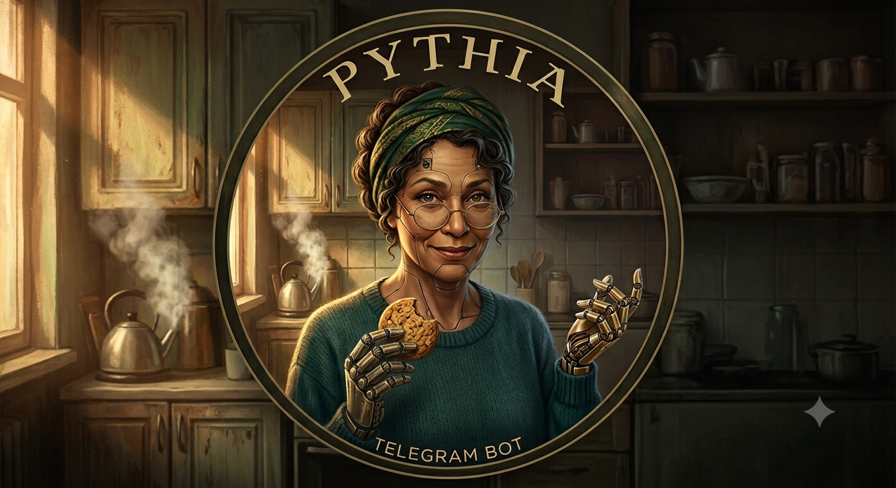

# prophet



Tarot prophet **Pythia** — authentic ritual readings on Telegram (web later).

## Docs

- Product idea: [`spec/`](spec/AGENTS.md)
- Architecture: [`tech/architecture.md`](tech/architecture.md)
- Ticket workflow: [`tech/tickets.md`](tech/tickets.md) — build work tracked as `T<n>.<m>` slices on `tech/*-tasks.md` boards

## Stack

Bun workspaces · TypeScript 7 · oxlint · Mastra · Grammy (adapter next) · Docker Compose + GHCR

## Packages

- `@prophet/core` — ritual, session, memory, Pythia agent
- `@prophet/telegram` — Grammy DM adapter

## Dev

```bash
bun install
bun run lint
bun run typecheck
bun test                                           # all packages
bun test packages/core/src/ritual/engine.test.ts   # single file
bun run bot
```

Pre-commit runs lint + typecheck.

## Env

Copy `.env.example` → `.env`. Set `TELEGRAM_BOT_TOKEN`, `DEEPSEEK_API_KEY` or `OPENAI_API_KEY`, and `MODEL_ID`.

## Deploy

Push to `master` → GitHub Actions builds → GHCR → VPS pulls via Docker Compose. Details: [`tech/architecture.md`](tech/architecture.md#deploy-locked).
