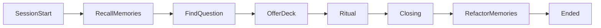

# Seeker Memory

## Purpose

Pythia remembers the seeker so each reading has continuity — without turning the product into endless companionship chat or a raw transcript vault.

## Lifecycle

1. **Recall** at session start (before / as intake) — load notes so continuity can be felt
2. **Save** during the session when something stable and useful appears
3. **Refactor** at session end — compress, dedupe, drop stale, keep voice consistent

## What belongs in memory

- Who they are to her (light relationship notes)
- **Optional soft profile** (prefer structured when stable): preferred name/address, language, age or age range, sex/gender — only if the seeker shared or confirmed them
- **Past deck choices** (and soft preference if shown)
- Recurring themes and prior reading gists (summaries, not full layouts)
- Open threads they may return to
- Practical preferences that aid fluency (pace, how they like reveals)
- Light “declined to share X” marks so she does not re-grill after a reject

## Soft profile (introduce)

Purpose: serve more accurate tone and counsel — not a CRM form.

- Ask during **first-session introduce / early intake**, woven into talk — one gentle ask at a time when natural
- Every field is **rejectable** (say no, skip, or ignore); ritual must not wait on demographics
- Prefer channel hints before asking: Telegram display name / `language_code` as defaults to refine, not quiz
- Age and sex are sensitive: optional; ranges and soft wording over interrogation
- Returning visits: use what she has fluently; do not reopen a declined field unless a long gap or the seeker invites it

Open: exact Phase 1 field set and whether age is range-only — tracked in [tech/telegram-tasks.md](../tech/telegram-tasks.md) (T3).

## Fluency rule

Recalled facts surface **only when they fit the moment**. Especially past deck: bring it up while offering a deck after the question lands — if natural. Never open with a memory dump. Soft profile is for register and address — never a stereotype lecture from age or sex alone.

## Out of scope

- Full chat transcript forever
- Invented biography
- Using memory to rewrite or “correct” card outcomes
- Group spectacle of private notes

## Privacy

Memories serve this prophet–seeker bond. They are not for public performance in group chat.

## Related

- Arc wiring: [session.md](session.md)
- Character: [character.md](character.md)
- Capabilities: [agent.md](agent.md)
