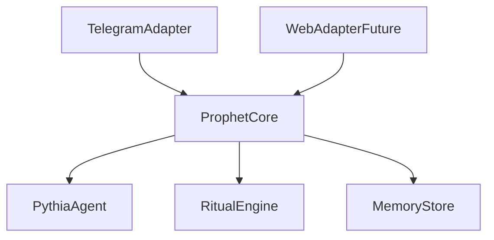
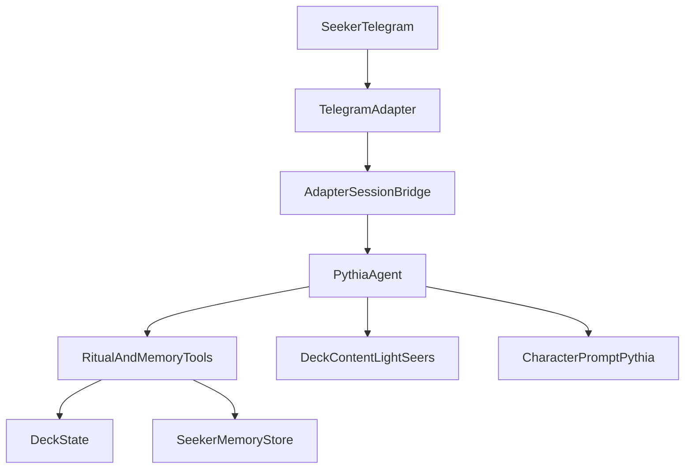

# Architecture (Phase 1)

Product contracts: [spec/](../spec/AGENTS.md). This doc is how we build them — not a rewrite of the idea.

Prophet code/product name: **Pythia**.

## Stack (locked for build)

| Layer | Choice | Role |
|-------|--------|------|
| Language | TypeScript **7** | App and agent logic |
| Runtime / packages | **Bun** (workspaces monorepo) | Install, scripts, tests, local run |
| Agent framework | Mastra | Pythia agent, tools, model calls |
| Telegram | Grammy | Phase 1 channel adapter (DM first) |
| Deploy | Docker Compose on VPS | Single compose stack |
| Images | GHCR on push to `master` | CI builds and pushes; VPS pulls |

### Models (locked)

Mastra model router: `provider/model-id`. Switch with `MODEL_ID`.

| Env | Purpose |
|-----|---------|
| `OPENAI_API_KEY` | OpenAI models |
| `DEEPSEEK_API_KEY` | DeepSeek models |
| `MODEL_ID` | e.g. `deepseek/deepseek-v4-flash` (default lean) or `openai/gpt-4.1-mini` |

Ritual engine uses **no LLM**. Models only for dialogue, tool choice, interpretation, memory refactor.

## Tooling (locked)

- `bun run typecheck` — `tsc --noEmit` (TypeScript 7)
- `bun run lint` — oxlint (ESLint’s typescript-eslint not stable on TS 7 yet)
- Pre-commit hook (`.githooks`) runs **lint + typecheck**

## Core vs adapters (locked)

Telegram is a **frontend adapter**. Ritual honesty, Pythia’s mind, and seeker memory live in a **channel-agnostic core**. A future web app is another adapter: it may expose richer UI tools, but those tools must call the same core ritual verbs — never invent cards or bypass deck state.

### Core (channel-agnostic)

- Pythia agent (character, intake, offer deck, interpret)
- Ritual engine (honest deck/desk state: shuffle / draw / return / rotate / open) — board [ritual-tasks.md](ritual-tasks.md)
- Seeker memory (recall / save / refactor)
- Session arc state machine

### Adapters (channel I/O only)

- **Telegram** (Grammy) — Phase 1: messages, buttons, DM identity
- **Web** (future) — richer chrome; optional UI tools that map onto core verbs

### Tool rule

Channel-specific tools are allowed for UX. They must invoke core ritual/memory/session operations. Authenticity contracts in `spec/` stay owned by the core path.

### Phase 1 module layout

One process, Bun workspaces — not microservices:

- `packages/core` — agent + ritual + memory + session (in-process interface)
- `packages/telegram` — Grammy adapter (after core MVP)

Public HTTP API only when a second client needs it.

## High-level shape (Phase 1 Telegram)

## State ownership

| State | Owner | Notes |
|-------|--------|------|
| Chat transport | Telegram adapter | Message I/O, buttons |
| Reading session arc | Core session + agent | Idle → recall → intake → offer deck → committed → ritual → closing → refactor → ended |
| Deck / desk | Core ritual engine | Mechanical pile + desk; tools mutate; agent narrates true state |
| Seeker memory | Core memory store + tools | Persist across sessions; refactor at end |
| Character | Prompt from [character.md](../spec/character.md) | Pythia |

## Conceptual verbs → tools

Map from [agent.md](../spec/agent.md):

| Verb | Tool / mechanism |
|------|------------------|
| Recall memories | `recallSeekerMemory` |
| Intake / lock question | Agent dialogue + `lockQuestion` |
| Offer / confirm deck | Agent dialogue + `confirmDeck` |
| Shuffle ops | `shuffle` (mix, cut, shift, rotate, seekerCut) |
| Select spread | `beginRitual` / select-spread layout |
| Draw / place | `draw` (pile → one desk slot; top/bottom/index); `drawToPositions` fills empty slots |
| Return | `returnToPile` (desk → pile; top/bottom/index) |
| Rotate (desk) | `rotate` (desk card orientation); pile rotate via `shuffle` |
| Open / reveal | `openPosition` |
| Inspect snapshot | `getDeckSnapshot` |
| Interpret | Agent (reads deck content + opened state) |
| Save memory | `saveSeekerMemory` |
| Close session | `closeSession` |
| Refactor memories | `refactorSeekerMemory` |
| Defer / refuse | Agent + `endWithoutRitual` |
| Closed ask (options) | `askWithOptions` (channel-agnostic; adapter chrome) |

Ritual/deck tool results return secrecy-safe snapshots only (`getDeckSnapshot` shape): face-down slots hide `defId` + orientation; pile identities never included. `peekDesk` is tests/trusted-only — not a Mastra tool.

## Deck content

- Phase 1: structured Light Seer’s body in `packages/core` derived from [spec](../spec/decks/light-seers.md)
- Card identity comes only from deck state

## Deploy (locked)

1. Push to `master` → GitHub Actions builds image → push to **GHCR**
2. VPS runs **Docker Compose** pulling that image
3. Secrets via env / compose env file on VPS — never in git

## Env / secrets (names only)

- `TELEGRAM_BOT_TOKEN`
- `OPENAI_API_KEY` / `DEEPSEEK_API_KEY`
- `MODEL_ID`
- Optional `MEMORY_DIR` / DB URL for seeker memory

## Out of scope here

- Stars / payments
- Group summon design
- Full multi-deck runtime bodies
- Card image CDN
- Web adapter implementation

## Build gate

If product rules change, update `spec/` first, then this doc, then code.
