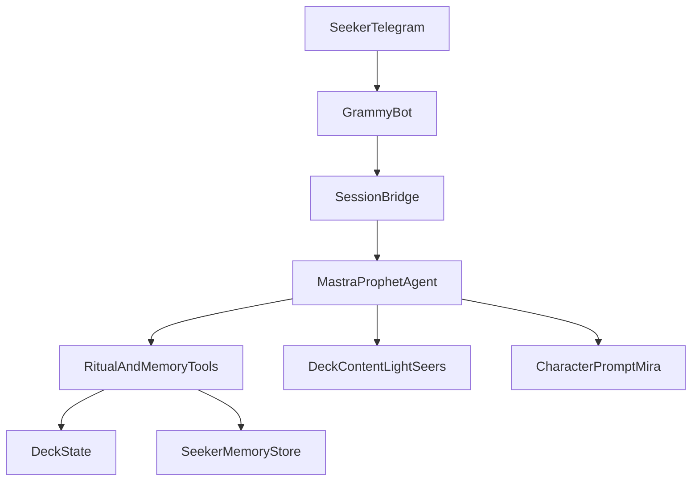

# Architecture (Phase 1)

Product contracts: [spec/](../spec/AGENTS.md). This doc is how we build them — not a rewrite of the idea.

## Stack (locked for build)

| Layer | Choice | Role |
|-------|--------|------|
| Language | TypeScript | App and agent logic |
| Agent framework | Mastra | Prophet agent, tools, model calls |
| Telegram | Grammy | Bot transport (DM first) |

## High-level shape

- **Grammy** receives messages, sends replies, optional light buttons
- **Session bridge** maps Telegram user/chat → active reading session
- **Mastra agent (Mira)** reasons with character + recalled memory + deck content; calls tools for mechanical ritual and memory writes
- **Deck state** is authoritative for cards; agent never invents draws
- **Seeker memory store** holds notes across sessions; agent recalls at start, saves during, refactors at end

## State ownership

| State | Owner | Notes |
|-------|--------|------|
| Chat transport | Grammy | Message I/O, buttons |
| Reading session arc | Session bridge + agent | Idle → recall → intake → offer deck → committed → ritual → closing → refactor → ended |
| Deck / table (order, orientation, face) | Ritual tools / deck engine | Mechanical; tools mutate; agent narrates true state |
| Seeker memory | Memory store + memory tools | Persist across sessions; refactor at end |
| Character | Prompt / config from [character.md](../spec/character.md) | Not mutable mid-reading by seeker |

## Conceptual verbs → tools

Map from [agent.md](../spec/agent.md):

| Verb | Tool / mechanism (conceptual name) |
|------|-------------------------------------|
| Recall memories | `recallSeekerMemory` |
| Intake / lock question | Agent dialogue + `lockQuestion` |
| Offer / confirm deck | Agent dialogue + `confirmDeck` |
| Shuffle ops | `shuffle` (ops: mix, cut, shift, rotate, seekerCut) |
| Select spread | `selectSpread` |
| Draw | `drawToPositions` |
| Open / reveal | `openPosition` |
| Interpret | Agent (reads deck content + opened state) — not a fake-draw tool |
| Save memory | `saveSeekerMemory` |
| Close session | `closeSession` |
| Refactor memories | `refactorSeekerMemory` |
| Defer / refuse | Agent + `endWithoutRitual` |

Inspectability: optional `getDeckSnapshot` for debugging / future UX — must not leak into inventing cards.

## Deck content

- Phase 1: load [Light Seer’s](../spec/decks/light-seers.md) (or a derived structured form generated from it)
- Catalog stubs remain for offer language; full ritual body is Light Seer’s until Phase 2
- Content feeds interpretation prompts; identity of drawn cards comes only from deck state

## Session flow (system)

1. Incoming DM → resolve seeker id → `recallSeekerMemory`
2. Agent intake until `lockQuestion`
3. Agent offers deck; `confirmDeck`
4. Ritual tools mutate deck state; agent narrates and interprets
5. `closeSession` → `refactorSeekerMemory`
6. Mid-ritual abandon: drop session; next visit fresh (Phase 1 UX lock)

## Env / secrets (names only)

- `TELEGRAM_BOT_TOKEN`
- LLM / Mastra provider keys as required by chosen model host
- Optional DB URL if memory store is not local-file for dev

Values live outside git (see root `.gitignore`).

## Out of scope here

- Stars / payments
- Group summon design
- Full multi-deck runtime bodies
- Card image CDN

## Build gate

Implement code only after this architecture matches current `spec/`. If product rules change, update `spec/` first, then this doc, then code.
